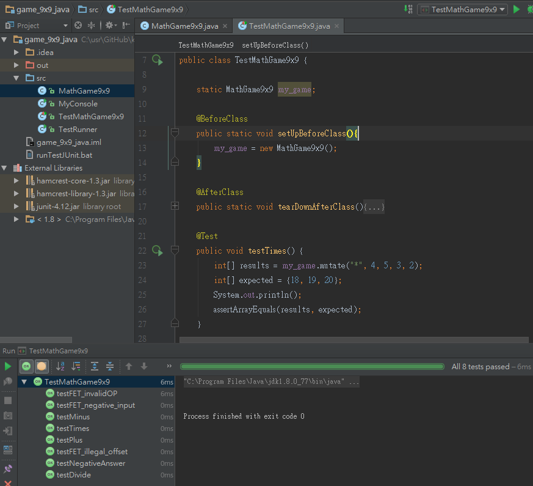

# MathGame9x9

### usage

```
MathGame9x9 my_game = new MathGame9x9();
int[] results = my_game.mutate("*", 4, 5, 3, 2);
// results equal to { 18, 19, 20 }
```

### integration and test

src/MyConsole.java
```
*, 4, 5, 3, 2
 18 19 20
```

src/TestMathGame9x9.java  


src/TestRunner.java
```
true
```
