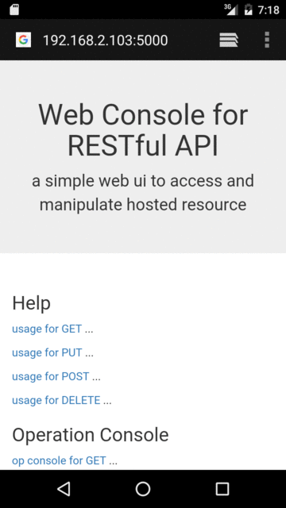
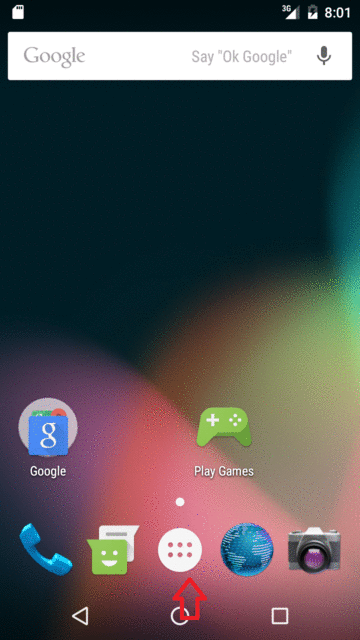
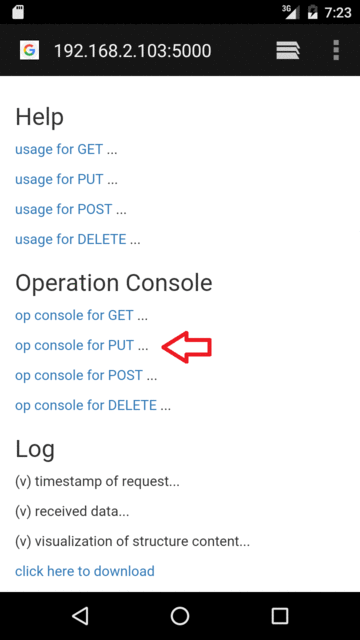
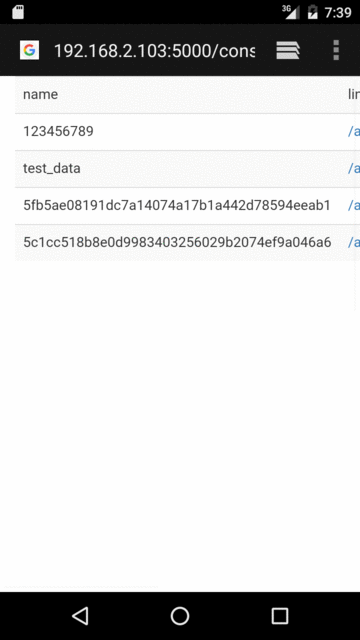
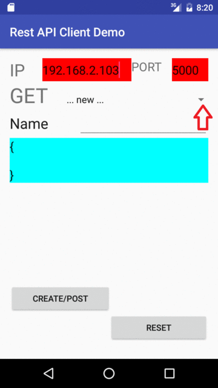
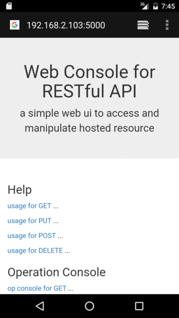
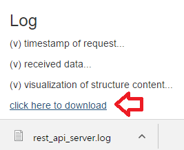

# Designing RESTful APIs
---

## Demo

* start server
 * python main.py
* invoke client
 * open browswer with http://127.0.0.1:5000/
 * install RestAPIClientDemo.apk and open it

| scenario\interface | Web UI | Android App |
|---|---|---|
| retrieve (get) |  |  |
| update (put) |  |  |
| create (post) |  |  |
| delete |  |  |
| log |  [content](demo/browswer_05_log1.png) |  |

---

## WEB API Implementation by Flask(python)

### GET /api/v1/resource
* return JSON to tell object list
 * (pass) test_api_v1_api_get_all_elements_list

### GET /api/v1/resource/resource-id
* return JSON to tell object's value
 * (pass) test_api_v1_api_get_element_by_id
 * (pass) test_api_v1_api_get_element_by_not_found_id

### PUT /resource/resource-id
* use new content to replace old item
* return JSON to tell result
 * (pass) test_api_v1_put_by_existent_id
 * (pass) test_api_v1_put_disallow_nonexistent_id

### POST /resource
* add item to resource
* return JSON to tell result
 * (pass) test_api_v1_post_by_creating_new_id_without_slash
 * (pass) test_api_v1_post_by_creating_new_id_with_slash

### POST /resource/resource-id
* (done) add item to resource, with user-specified name (resource_id)

### DELETE /resource/resource-id
* delete item from resource
* return JSON to tell result
 * (pass) test_api_v1_post_then_delete
 * (pass) test_api_v1_delete_disallow_nonexistent_id
 * (pass) test_api_v1_delete_disallow_action_without_id

--

## Web Interface and Test Kit

### list all objects
* (done) /console/get

### put(update) object
* (done) /ui/put/123456789

### delete object
* (done) /ui/delete/123456789

### post(new) object
* (done) /console/post

--

## Logging Mechanism
* (done) /static/log/rest_api_server.log

### log for http server
* (done) on log file

### log for rest api
* (done) on log file

### visualization (in debug log)
* (done) pretty for json or object

--
## Android App to Interact with Web API
### ../103_rest_client
* (done) android app with one activity, one spinner, four editTexts and few buttons
* Spinner
 * (done) listing all elements' names, via http get
 * (done) show value of selected element, via http get
* Buttons
 * (done) delete
 * (done) put
 * (done) post
 * (done) reset

---

### Reference
 * RESTful API hosting by Python (flask)
  * http://blog.luisrei.com/articles/flaskrest.html
 * Android App as REST API Client
   * https://developer.android.com/training/basics/network-ops/managing.html
   *  https://developer.android.com/training/basics/network-ops/connecting.html#http-client
